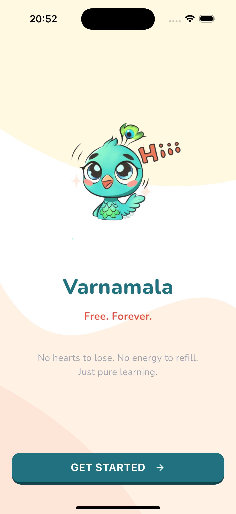
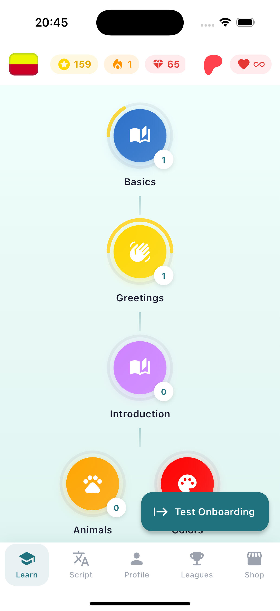
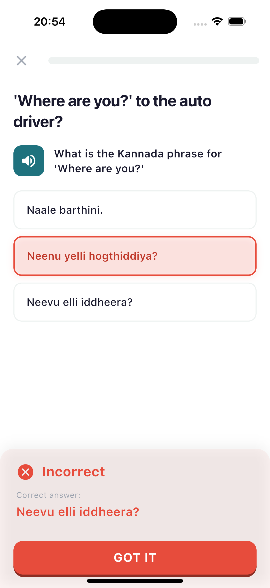
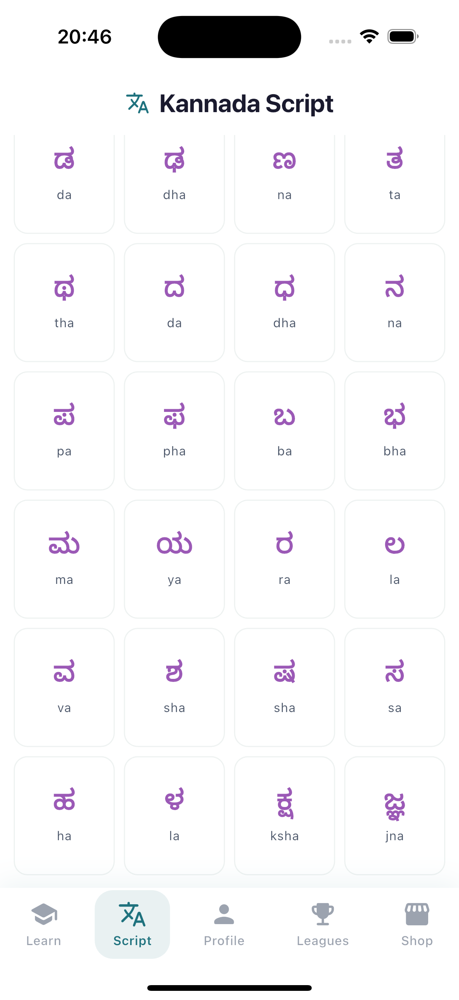
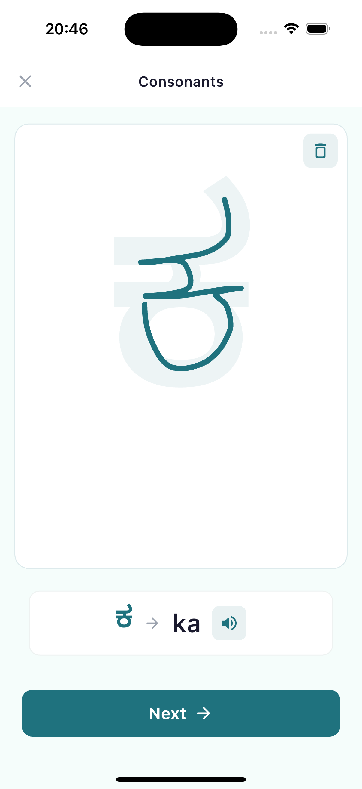
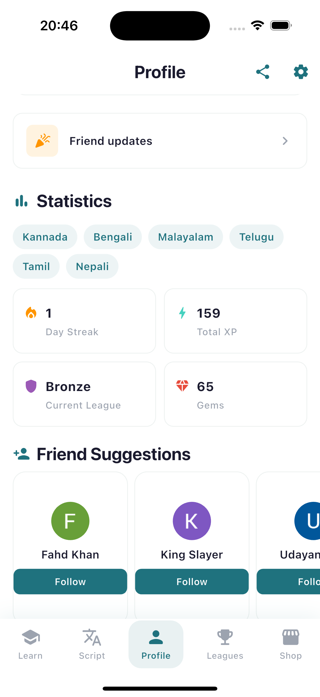
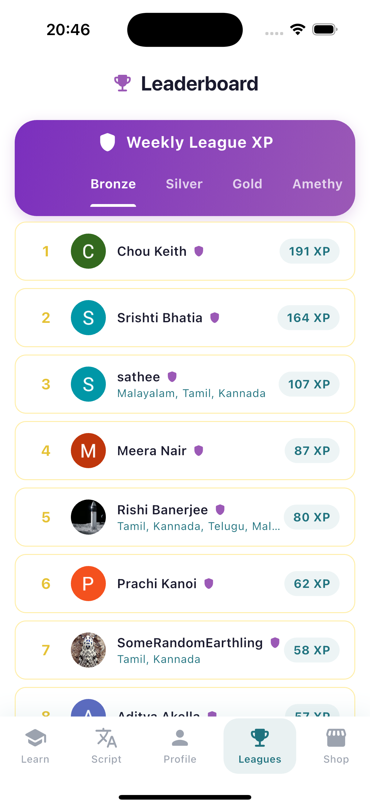
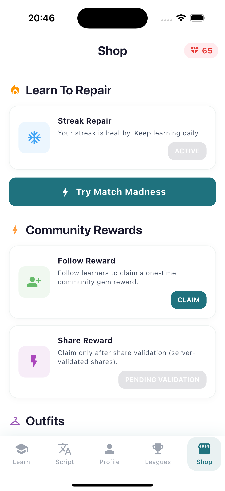

# Varnamala: Reclaiming Language Learning 🦚


[](https://www.patreon.com/your-patreon-link)
[](https://discord.gg/eVpmZp4Ktt)

**Varnamala** is an open-source, community-driven language learning platform built with Flutter.

### 🌍 Our Mission
We are reclaiming language learning from corporate interests.
*   **No Hearts, No Energy:** Learning shouldn't stop because you made a mistake.
*   **No Pay-to-Win:** Education should be accessible to everyone, everywhere.
*   **Real Languages:** While others focus on fictional languages like High Valyrian, we focus on connecting humanity through languages spoken by billions but ignored by major apps—**Kannada, Tamil, Telugu, Malayalam, Hindi**, and indigenous languages.

---

### 🤝 Support the Project

This is a passion project. If you believe in open, ad-free education, consider supporting us:

<a href="https://www.patreon.com">
  
</a>

Your support helps us add more languages, maintain servers, and keep the app free forever.

---

### 🛠️ Technical Architecture

Varnamala is built on a robust **Flutter** frontend with a **Firebase** backend, designed for scalability and ease of contribution.

#### Firebase Integration
The app relies on Firebase for its core gamification features:
*   **Authentication:** Secure Google Sign-In to save progress across devices.
*   **Firestore Database:** Real-time synchronization of:
    *   **User Stats:** XP, Level, Gems.
    *   **Streaks:** Logic to track daily activity and freeze protection.
    *   **Leaderboards:** Global and league-based rankings.
*   **Remote Config:** Dynamic updates to course content without app store releases.

#### Code Logic
*   **State Management:** Uses `Provider` for reactive UI updates (e.g., when you earn XP, the UI updates instantly).
*   **Dependency Injection:** `GetIt` + `Injectable` for clean, testable architecture.
*   **Course Engine:** Courses are defined in JSON/Dart structures, making it incredibly easy to add new languages.

---

### 🚀 Roadmap: Expanding the World

We are currently supporting South Indian languages, but we are just getting started.

**Current Languages:**
✅ Kannada  ✅ Tamil  ✅ Telugu  ✅ Malayalam

**Upcoming Languages:**
🚧 Hindi
🚧 Bengali
🚧 Odia
🚧 Native American Languages (Navajo, Cherokee)

We are building a modular system where **anyone** can contribute a course file to add their native language to the platform.

---

### 💻 Installation & Contributing

1. **Clone the repository:**
   ```bash
   git clone https://github.com/rshrc/Varnamala
   ```
2. **Install dependencies:**
   ```bash
   flutter pub get
   ```
3. **Generate code (Freezed/JSON Serializable):**
   ```bash
   flutter pub run build_runner build --delete-conflicting-outputs
   ```
4. **Run the app:**
   ```bash
   flutter run
   ```

**Note:** You will need your own `google-services.json` (Android) and `GoogleService-Info.plist` (iOS) files to run the app locally with Firebase features. See [FIREBASE_CONFIGURATION.md](FIREBASE_CONFIGURATION.md).

---

### Screenshots

| Home | Lesson | Profile | Alphabets |
|:---:|:---:|:---:|:---:|
|  |  |  |  |

| Writing | Socials | Leagues and Leaderboard | Games |
|:---:|:---:|:---:|:---:|
|  |  |  |  |

---

**Join us in building a more learned world.**
All PRs are welcome! Whether it's fixing bugs, adding a new language course, or improving the UI.
